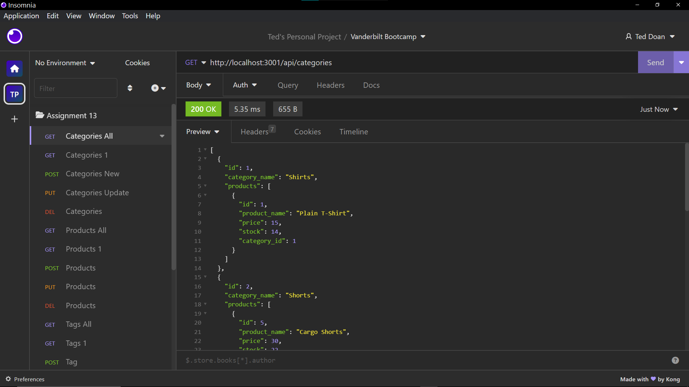
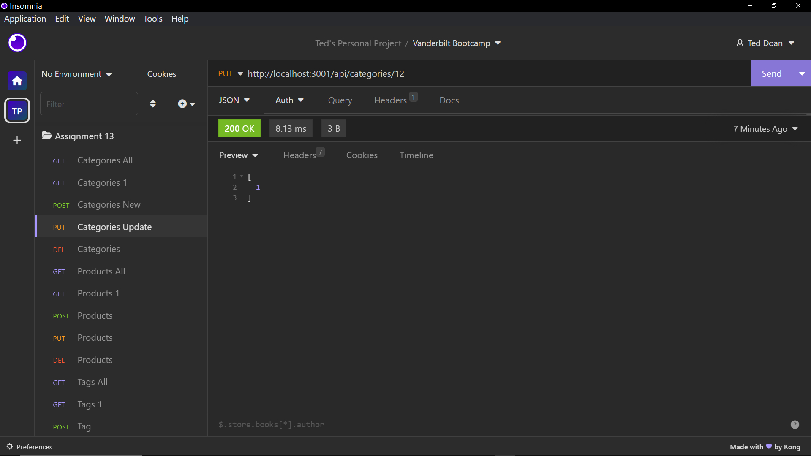
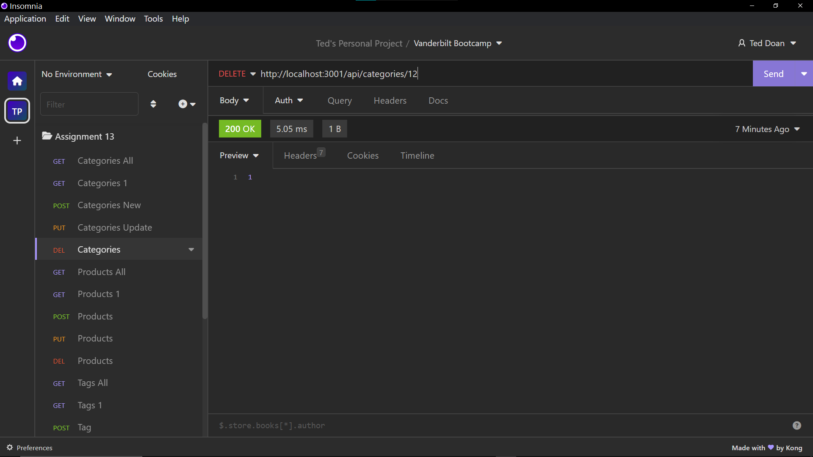

# E-Commerce Back End

This is the back end for an e-commerce site.

<br>

## Table of Contents

- [Description](#description)
- [Usage](#usage)
- [References](#references)
- [Links](#links)
- [Features](#features)
- [Installations](#installations)
- [User Story](#user-story)
- [Acceptance Criteria](#acceptance-criteria)

<br>

## Description

- This program is the back-end of an e-commerce website. User will need to use Insomnia to hit each route.

<br>

## Usage

- Use Insomnia or similar software to hit each GET, POST, PUT, DELETE route of Products, Categories and Tags
- Start the server with 'npm start'

  
  
  
  

<br>

## Links

- Github page: https://github.com/teddysm/E-Commerce-Back-End
- Video walkthrough: https://drive.google.com/file/d/177VAf8o0hxIPvlIdtOYVsGUOtZBkn5Tm/view

<br>

## Features

- User can view all tags, categories and products as well as edit and delete them. User can also create new tags, categories and products.

<br>

## Installations

- Users need to install the dependencies with the command "npm i".
- Users need to install Insomnia or similar software.

<br>

## User Story

```md
AS A manager at an internet retail company
I WANT a back end for my e-commerce website that uses the latest technologies
SO THAT my company can compete with other e-commerce companies
```

## Acceptance Criteria

```md
GIVEN a functional Express.js API
WHEN I add my database name, MySQL username, and MySQL password to an environment variable file
THEN I am able to connect to a database using Sequelize
WHEN I enter schema and seed commands
THEN a development database is created and is seeded with test data
WHEN I enter the command to invoke the application
THEN my server is started and the Sequelize models are synced to the MySQL database
WHEN I open API GET routes in Insomnia for categories, products, or tags
THEN the data for each of these routes is displayed in a formatted JSON
WHEN I test API POST, PUT, and DELETE routes in Insomnia
THEN I am able to successfully create, update, and delete data in my database
```
